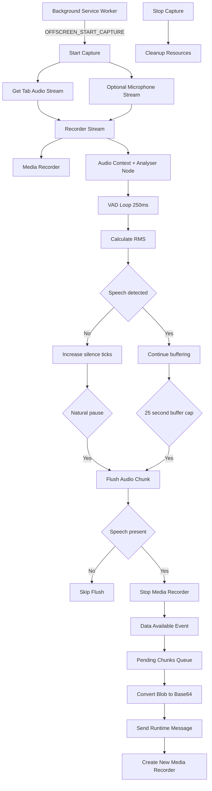

# Offscreen Audio Capture Architecture

## Overview
`offscreen.ts` is the core audio orchestration layer used by Late Meet for browser tab recording and voice-aware segmentation.

It is responsible for:

* Capturing browser tab audio
* Optionally capturing microphone input
* Running voice activity detection (VAD)
* Generating waveform data
* Creating speech-aware audio chunks
* Sending finalized chunks for downstream processing

Unlike traditional recording systems that emit chunks on fixed intervals, Late Meet uses voice activity detection to determine when a recording segment should be finalized. This produces more natural chunk boundaries aligned with pauses in speech.


## Architecture Flow

## Message Lifecycle
The offscreen document operates using a message-driven architecture through `chrome.runtime.onMessage`.

The background service worker communicates with the offscreen document using `OFFSCREEN_*` events.

Key messages include:

### `OFFSCREEN_PING`

Used to verify that the offscreen document is active and responsive.

### `OFFSCREEN_START_CAPTURE`

Triggers `startCapture()` and initializes:

* tab audio capture
* optional microphone capture
* media recording
* waveform sampling
* voice activity detection

The message may include:

* `streamId`
* `tabId`
* `includeMicrophone`
* `vadThreshold`

### `OFFSCREEN_STOP_CAPTURE`

Triggers `stopCapture()` and begins cleanup of timers, recorders, and remaining queued chunks.

## Capture Initialization
Capture begins inside `startCapture()`.

The browser tab audio stream is obtained using:

```ts
getTabAudioStream(streamId)
```

This internally calls:

```ts
navigator.mediaDevices.getUserMedia()
```

with Chrome tab capture constraints.

If microphone capture is enabled, `getMicrophoneStream()` requests an additional audio stream with:

* echo cancellation
* noise suppression
* auto gain control

The tab stream and optional microphone stream are merged into `recorderStream`, which is later consumed by `MediaRecorder`.

Audio analysis is performed using:

* `AudioContext`
* `AnalyserNode`

These components are used by both waveform sampling and voice activity detection.

## Voice Activity Detection (VAD)
Late Meet uses **voice activity detection (VAD)** to determine when audio segments should be finalized.

Instead of splitting recordings at fixed time intervals, the system monitors audio energy levels and flushes chunks when natural pauses in speech are detected.

VAD runs on a timer every `250ms` using:

```ts
VAD_SAMPLE_MS = 250
```

During each cycle:

1. `getCurrentRms()` reads audio data from `AnalyserNode`.
2. RMS (Root Mean Square) signal energy is calculated.
3. `VoiceActivityTracker` observes the current audio level.
4. Silence duration is tracked using `silenceTicks`.

Speech detection is determined by comparing the RMS level against:

```ts
rmsThreshold
```

If RMS falls below the threshold:

```ts
rms < rmsThreshold
```

the silence counter increases.

If speech resumes, the silence counter resets.

This allows Late Meet to align chunk boundaries with natural pauses in conversation rather than arbitrary timestamps.


## Audio Chunk Flushing
Audio segments are finalized through `flushAudioChunk()`.

A flush occurs when either of these conditions is met:

### Natural Pause Detection

If silence persists long enough:

```ts
silenceTicks >= SILENCE_FLUSH_TICKS
```

Late Meet assumes the speaker has paused and finalizes the current segment.

The silence threshold is derived from:

```ts
SILENCE_FLUSH_MS = 1500
```

which corresponds to approximately **1.5 seconds of silence**.

### Overflow Protection

To prevent indefinitely growing buffers, recording is forcefully flushed after:

```ts
MAX_BUFFER_MS = 25000
```

or roughly **25 seconds**.

This ensures memory usage remains bounded during long uninterrupted speech.

### Speech-Aware Flushing

Before finalizing a segment, the system verifies whether meaningful speech occurred:

```ts
voiceActivity.consumeShouldFlush()
```

If no viable speech is detected, the chunk is skipped.

This avoids generating unnecessary silent audio segments for downstream transcription.

## Recorder Recreation Strategy
Late Meet intentionally recreates the `MediaRecorder` after each finalized audio segment.

Instead of using:

```ts
requestData()
```

the system stops the active recorder.

This is an intentional design choice.

Using `requestData()` may produce **headerless WebM fragments**, which downstream speech-to-text systems cannot reliably decode.

Instead, `flushAudioChunk()`:

1. Stops the active recorder.
2. Waits for the `dataavailable` event.
3. Stores the completed audio chunk.
4. Creates a fresh recorder instance.

This guarantees every emitted segment is a **complete and independently decodable WebM file** containing its own initialization metadata.

Recorder shutdown is coordinated using:

```ts
stopRecorderAndAwaitData()
```

which waits for the final `dataavailable` event before continuing processing.


## Queue Management and Backpressure
Finalized audio chunks are temporarily stored inside:

```ts
pendingChunks
```

When `dataavailable` fires, valid audio blobs are added to the queue through:

```ts
handleRecorderDataAvailable()
```

To avoid excessive memory usage, Late Meet applies **backpressure control**.

If queued chunks reach:

```ts
MAX_PENDING_CHUNKS = 20
```

the recorder is temporarily paused.

This prevents the recording pipeline from growing indefinitely if downstream processing becomes slower than audio generation.

When queued chunks are drained, recording can resume.

### Drain Timeout Protection

Late Meet also includes timeout-based recovery through:

```ts
drainWithTimeout()
```

If draining exceeds:

```ts
DRAIN_TIMEOUT_MS = 30000
```

or **30 seconds**, remaining queued chunks are dropped and the recorder is restarted.

This prevents stalled queues from blocking future audio processing indefinitely.

## Waveform Sampling
Waveform visualization is sampled independently from the VAD pipeline.

Every:

```ts
WAVEFORM_INTERVAL_MS = 100
```

or **100 milliseconds**, the system samples waveform data from `AnalyserNode`.

The waveform is generated by:

```ts## Shutdown and Cleanup

Capture shutdown is coordinated through:

```ts
stopCapture()
```

To avoid duplicate cleanup execution, the function first checks:

```ts
isStopping
```

During shutdown:

1. VAD timers are cleared.
2. Waveform timers are cleared.
3. `MediaRecorder` is stopped.
4. Remaining pending chunks are drained.
5. Audio resources are cleaned up.

This ensures that partially recorded audio is processed before resources are released.

The shutdown flow prevents orphaned timers, leaked media streams, and incomplete chunk delivery.

sampleAndSendWaveform()
```

This function:

1. Reads audio time-domain data using `getByteTimeDomainData()`.
2. Divides the signal into buckets.
3. Normalizes amplitude values.
4. Sends waveform data through:

```ts
chrome.runtime.sendMessage({
  type: "WAVEFORM_DATA"
})
```

Waveform sampling is independent from chunk flushing and exists primarily for UI feedback and visualization.
Waveform visualization is sampled independently from the VAD pipeline.

Every:

```ts
WAVEFORM_INTERVAL_MS = 100
```

or **100 milliseconds**, the system samples waveform data from `AnalyserNode`.

The waveform is generated by:

```ts
sampleAndSendWaveform()
```

This function:

1. Reads audio time-domain data using `getByteTimeDomainData()`.
2. Divides the signal into buckets.
3. Normalizes amplitude values.
4. Sends waveform data through:

```ts
chrome.runtime.sendMessage({
  type: "WAVEFORM_DATA"
})
```

Waveform sampling is independent from chunk flushing and exists primarily for UI feedback and visualization.

## Shutdown and Cleanup

Capture shutdown is coordinated through:

```ts
stopCapture()
```

To avoid duplicate cleanup execution, the function first checks:

```ts
isStopping
```

During shutdown:

1. VAD timers are cleared.
2. Waveform timers are cleared.
3. `MediaRecorder` is stopped.
4. Remaining pending chunks are drained.
5. Audio resources are cleaned up.

This ensures that partially recorded audio is processed before resources are released.

The shutdown flow prevents orphaned timers, leaked media streams, and incomplete chunk delivery.
